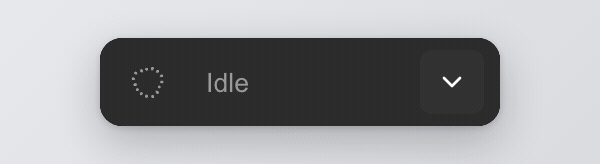

# design-os-figma-plugin

**An agent and a designer in the same Figma file.** A Figma Free plugin + CLI that lets
an AI coding agent draw on a real canvas, read back what a human just changed, and never
let the two trample each other.

<p align="center">
  
</p>
<p align="center"><sub>One row, hugging its content: connection, semantic activity, file targeting, and pending sync.</sub></p>

Part of the [ease-design](https://github.com/jangtrinh/design-os) toolchain — this repo is
the optional, non-deterministic "hands" for its Figma authoring track. It talks to Figma only
through the public Plugin API (Figma Free, no paid write API, no OAuth, no seat).

```
skills/figma-agent/SKILL.md ⇢ the agent          (emitted from this CLI's own command table)
                              ↓
you / an agent CLI ⇄ figma-agent CLI ⇄ local WebSocket broker (ports 9410-9419)
                                              ⇄ Figma plugin (Plugin API) ⇄ canvas
```

## Why this exists

Every AI-on-Figma setup hits the same four walls. Before any work starts, **the agent has
no idea how to connect** — every session opens with the same ritual of "is the broker up,
is the plugin open, which commands does this build even have". Then the agent's work
collapses into **one giant undo step** — press ⌘Z after twenty minutes of automated work
and twenty minutes disappear. The designer's own edits are **invisible to the codebase** —
a human moves a component, and whatever registry the agent builds from quietly goes stale.
And when both act at once, they **trample each other** — half-applied scripts, overwritten
changes, no way to tell what happened. This plugin exists to remove exactly those four
walls.

### The agent arrives already knowing

The transport was never the missing piece — the broker starts on demand and the plugin
reconnects itself. What was missing is **knowledge at the moment a session opens**. So the
CLI hands it over:

```sh
figma-agent install-skill            # into ~/.claude/skills by default; --folder to redirect
figma-agent install-hook --dry-run   # show the SessionStart hook; --dry-run writes nothing
```

The skill's command reference is **emitted from the CLI's own command table** — the same
table `--help` renders — and a test fails the build when the committed file and the
emitter disagree. A reference that can drift is a reference that will, so this one cannot:
add a command and forget to document it, and CI says so by name.

The hook runs one cheap question at every session start:

```sh
figma-agent status --peek            # never spawns a broker; idle is a normal answer, exit 0
```

It reads the broker's `/tmp` advertisement and, only if one is live, asks it a single short
question — a session start must never leave a daemon behind on a machine that wasn't going
to use one. The answer carries `versionMatch` / `protocolMatch`, so a plugin build that no
longer matches the CLI is visible before it causes a confusing failure — `null` there means
*the plugin never reported a version*, never "mismatch", and a broker that doesn't answer in
time reports `connected: null` rather than guessing either way.

Neither installer touches anything without asking. `install-skill` compares versions and
prompts before overwriting; `install-hook` backs up your settings first, refuses outright if
it can't parse them as JSON, and leaves the file untouched on `--dry-run`. A machine without
the CLI installed runs the hook as a silent no-op instead of failing a session.

### Your edits reach the codebase — the right codebase

Every change a designer makes is captured live and, after the file goes quiet, offered back
as one prompt: **"N changes ready — Sync now."** A click runs a deterministic reconcile step
over the ledger — no model sits in that path, so a sync is reproducible and auditable. And a
sync cannot guess where it goes: each Figma file is bound to **its** project once —

```sh
figma-agent bind --file "Design System v4" --dir ~/code/your-app
```

— and from then on that file's changes land in that project's registry, never in whatever
directory a process happened to start from. Unbound files stage safely and migrate on bind.
The confirmation never flatters itself: *"Synced — 3 added, 1 updated"* only when records
were actually written, *"Nothing synced"* when the run landed nothing, and a failure keeps
the prompt alive so the retry is still there. `figma-agent changes` reads back the owner's
edit history as plain sentences any time — even while the plugin is closed, thanks to a
reconnect gap-fill diff.

### The agent cannot wreck your file

Every mutating operation seals **its own undo step** — ⌘Z rolls back one thing, not the
whole session. Arbitrary scripts run inside a bracket that **undoes itself on error**, and
reports `rolledBack: true` only when the rollback actually completed. Mutations are **jobs**:
one runs per file at a time, the rest queue in order, reads bypass the queue. A timeout tells
you the work was *not* cancelled and hands you a job id to poll; cancel actually cancels; a
reply that arrives after a job was killed is discarded, never served. If transport drops
after a mutation was dispatched, its outcome is unknown: poll the job, inspect the canvas,
then run the reported bare `job <id> --force-release` command. Never retry that mutation
automatically. Nothing is ever lost
silently — every eviction, prune, and rotation leaves a counter, an archive, or an audit
record. Every error lands in `design/figma-errors.jsonl` with its full untruncated reason —
a log written for the agent that caused it, so it can read and fix — and `figma-agent errors`
reads it back without ever crashing on a bad line.

### Multiple files, one broker

Several open Figma files stay connected at once — they no longer evict each other. Commands
without a target prefer a ready file; set `FIGMA_AGENT_FILE` to pin the default by name.
Exact `--file`/`--instance` targets never fall through to a different file. If the exact
target is connected but app-unready, the broker probes only that target, then dispatches
once after readiness returns or fails with bounded `E_APP_UNREADY`. Several
*agents* can share one file too: pass `--agent claude` (or set `FIGMA_AGENT_ID`) and the
panel's activity feed labels each entry with the harness that sent it, so a designer
watching the canvas can tell who just did that. Omit it and the wire frame is byte-identical
to what a pre-flag CLI sent — the panel's own `cli` default is applied when the row renders,
never stamped onto the request.

`status` reports transport and application state separately. `state: "connected"` means
the WebSocket is open; `appState: "ready"` means the Figma app recently answered, while
`"unready"` means an open socket whose app is silent or background-throttled.
`appHeartbeatMode: "legacy"` identifies an older compatibility heartbeat; incomplete or
unsupported readiness advertises `"unknown"` instead of guessing. Readiness gates only
agent dispatch: manual Figma edits remain available and continue through the existing
change feed and reconnect gap-fill.

## Install / build

```bash
git clone https://github.com/jangtrinh/design-os-figma-plugin.git
cd design-os-figma-plugin
npm install
npm run build         # cli/dist/figma-agent.js + plugin/code.js + plugin/ui.html
```

## Load the plugin

Figma Desktop → Plugins → Development → Import plugin from manifest → select
`plugin/manifest.json`. Keep it open while using the CLI; the CLI's broker daemon
auto-starts on your first command and the plugin auto-reconnects to it.

## Bind a file to a project, then use the CLI

```bash
FA="node $(pwd)/cli/dist/figma-agent.js"
$FA status --peek                                 # is anything alive? never spawns anything
$FA status                                        # spawns the broker if absent; needs the plugin open
$FA bind --file "Design System v4" --dir ~/code/your-app
$FA create-frame --name Card --w 320 --h 200 --agent claude
$FA html-to-figma --html page.html --width 1440
$FA export-png --node <id> --out out.png          # then read the file to see the result
$FA changes --owner-only                          # the designer's own edits, in plain sentences
$FA cowork --wait 3                               # block until the designer stops editing
$FA errors --limit 10                             # what went wrong, and why
```

Every command prints one JSON object to stdout. `figma-agent --help` lists all of them, and
so does `skills/figma-agent/SKILL.md` — both rendered from one command table, so they cannot
disagree.

**When the plugin isn't open yet**, Figma offers no API to open it for you — that click is
the one step that stays human. `status --wait` shrinks it to exactly that:

```bash
$FA status --wait --timeout 60    # blocks until a plugin registers; prints the figma:// link
```

The link comes from the file's bind record. When one can't be built — an unbound file, or a
plugin build that never reported a `fileKey` (reading it needs `enablePrivatePluginApi` in the
manifest, which this repo now ships) — it says which of the two it is instead of printing a
URL that opens nothing. On timeout it exits non-zero with `E_NO_PLUGIN`.

## The deterministic kernel (reconcile)

`figma-agent`'s own commands are enough to draw, read, and log. Turning a captured change
feed into an actual component-registry update runs through the deterministic kernel,
[`ease-design`](https://github.com/jangtrinh/design-os) (`npm i -g ease-design`) — install
it once and its `ui figma reconcile --apply` / `design-os figma reconcile` closes the loop
described above. No model call sits anywhere in that path.

## Structure

```
cli/          figma-agent CLI: commands, the broker daemon + WS transport
plugin/       Figma plugin: main-thread executor + a hidden-iframe HTML→Figma converter
shared/       wire-protocol types shared by cli/ and plugin/
scripts/      esbuild build script + an optional probe/ suite (site recon, visual diff)
tests/        vitest unit tests (pure-logic; run with `npm test`)
```

`tests/figma-plugin-panel.test.ts` runs the same layout, accessibility, taste, and content
linters as ease-design-generated artifacts. They come from the exact dev dependency
`ease-design@0.5.0`, so `npm ci` is sufficient to run the panel gate in a fresh clone.

## Supervised editing loop

`inspect` resolves an explicit node first and otherwise uses the current selection. It
returns the scoped node spec and a PNG marked `VISUAL_CHECK_REQUIRED`; run it before and
after visual mutation.

`clone-traits` copies only named groups: `layout`, `fills-variables`, `typography`,
`spacing`, and `text`. Text content is never copied unless `text` is explicitly included.

Successful typed mutations stamp agent-operation provenance. A later designer edit on the
same node becomes an immutable linked correction in Figma shared plugin data.
`sync-corrections` merges that bounded edge cache into the project's own
`design/memory/figma-corrections.jsonl`. Same-ID/different-hash conflicts are quarantined;
corrections never promote themselves into knowledge.

`cowork` is the live door onto that same ledger — no second store, no polling. It waits for
one **designer change-cycle**: the designer edits, then goes quiet for `--wait` seconds, and
the command returns with the nodes they touched plus any corrections still pending on them.

```bash
$FA cowork --wait 3 --timeout 600   # both in seconds; read-only against the ledger
```

Only a live edit whose actor is the *owner* arms that cycle — the agent's own writes, an
edit nobody could confidently attribute, and the gap-fill replay after a reconnect all leave
it alone, so an agent can never wake itself up. Quiet for the whole budget is a normal
answer (`cycles: 0`, exit 0), not an error, and the plugin disconnecting mid-wait refuses
with a reconnect hint rather than hanging to the deadline. Edits it declined to attribute
are reported as a count rather than dropped.

## The adaptive agent rail

Once loaded, the plugin is a single `44px` row and nothing else — there is no expanded
state. Its width hugs whatever the row is currently saying: the iframe measures the rendered
row and the plugin main thread clamps that to `240–560px`, so the panel covers as little of
the canvas as the sentence allows and the host window title still reads in full. **Keep it
open** while you or an agent drive the CLI; closing it drops the connection. Multi-file
targeting and pending sync appear only when they matter. The sizing contract lives in
[`panel-model.ts`](plugin/src/ui/panel-model.ts), with the
[`panel gate`](tests/figma-plugin-panel.test.ts) and a Chromium
[`hug measurement`](tests/panel-rail-geometry.test.ts) behind it.

The Thinking Orb gives peripheral progress without adding another icon or a verbose status
panel. Stable command identity selects semantic motion; it never guesses from user-facing
labels. Concurrent operations converge on a coordinating state, while an unknown future
command falls back to Processing instead of inventing meaning. The taxonomy and priority
rules are owned by [`orb-command-state.ts`](plugin/src/ui/orb-command-state.ts),
[`thinking-orb.ts`](plugin/src/ui/thinking-orb.ts), and their
[`behavior tests`](tests/orb-command-state.test.ts).

`COWORK` maps to Listening only when that activity is visible to the plugin. A broker-side
wait does not fabricate plugin telemetry, so the rail stays truthful when no such event
exists.

The row's one sentence is ranked, never merged: any edits the relay lost while offline first,
then connection trouble, then sync, then the current activity, then `Idle`. A lost edit leads
the line and is the one part that never shrinks, so when the row runs out of width the ellipsis
can only ever cut what ranks below it. Whatever the line had no room for stays readable in its
tooltip, and a sentence past the width ceiling ellipses rather than growing. Full history lives
in the CLI — `figma-agent status`, `figma-agent changes`, `figma-agent errors`.

Pending edits show as a count badge on the sync button, and clicking it runs the sync; the
result lands in the sentence. A failed or unbound sync keeps the button for the retry, and only
a genuine success clears the count. Unresolved failures show as a red count next to the line;
the line itself is the button that marks them seen, which clears that count and the orb's
*Needs attention*. Nothing is deleted — the failures stay in the edit feed and in `figma-agent
errors` — and the next failure re-arms both. Every icon action is a locally vendored Lucide SVG with a
tooltip, accessible name, keyboard focus, and a 32px target. The orb canvas is decorative; its
labelled cell announces the semantic status (and carries the build identity in its tooltip), and
reduced motion renders a static frame instead of continuous animation.

## Multiple files open at once

`figma-agent status` lists every connected file (`plugins[]`) and marks the **active** one
(`activePlugin`). By default a command goes to the file you touched most recently. To pin
commands to a specific file regardless of recency:

```bash
FIGMA_AGENT_FILE="VSF" $FA html-to-figma --html page.html   # only ever the "VSF …" file
```

With the pin set and no open file matching, the command waits briefly then fails with
`E_NO_PLUGIN` naming the requested file and listing the ones actually connected.

**Troubleshooting**

- **Panel says "No broker yet" and never connects** — that's the resting state; it only
  connects once a CLI command spawns the broker. Run `figma-agent status` to spawn + verify.
- **`E_NO_PLUGIN`** — the broker is up but no panel is connected: open (or reopen) the plugin
  and retry, or run `figma-agent status --wait`, which blocks until one registers and prints
  the file's `figma://` link while it waits. Right after a rebuild the broker hot-replace can
  race the panel's reconnect (<1s) — just retry.
- **Stuck on "Looking for broker…"** — confirm a CLI command has actually run (the broker is
  demand-started) and that nothing else holds ports 9410–9419. `figma-agent status` is the
  one-shot health check.

## The `probe/` suite (optional)

`scripts/probe/` holds a small set of Playwright/Puppeteer-based helpers for reconnaissance
and visual-diff work on external sites (recon, network capture, screenshot diffing). These
use heavier browser-automation dependencies (`playwright`, `puppeteer-core`, `pixelmatch`,
`pngjs`) declared as `optionalDependencies` — they do not block installing or building the
core CLI/plugin if they fail to install in a given environment. Run `npm install playwright`
inside this repo to enable them.

## Attribution

- Broker/relay design adapted from `southleft/figma-console-mcp`'s websocket-server
  pending-request correlation and heartbeat approach (MIT).
- The auto-connect surface — distributing a CLI's own skill to an agent, an `--agent`
  presence label, and the "wait one designer change-cycle" idea — follows patterns studied in
  `newfiction/cast-to-figma` (MIT). Patterns only, no code vendored; see
  [THIRD-PARTY.md](THIRD-PARTY.md).
- The plugin's HTML→Figma converter and node executors are ported from an earlier EaseUI
  internal tool (`figma-export.ts` / `figma-plugin/code.ts`).
- `scripts/probe/` ideas draw on `Jane-xiaoer/claude-skill-web-clone`'s `visual-diff.mjs`
  approach to measurable pixel-diff scoring.

## License

MIT — see [LICENSE](LICENSE).
