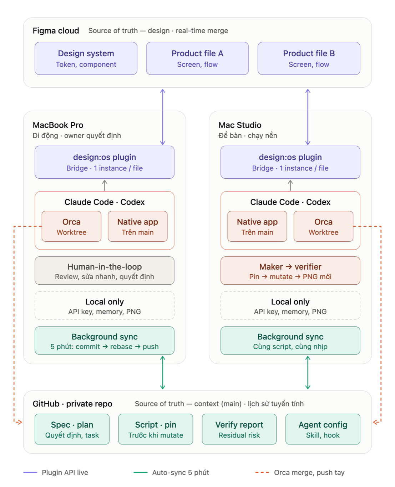

# design-os-figma-plugin

Let your AI agent inspect and edit Figma while you keep designing.

[](https://github.com/jangtrinh/design-os-figma-plugin/actions/workflows/ci.yml)
[](https://github.com/jangtrinh/design-os-figma-plugin/releases)
[](https://github.com/jangtrinh/design-os-figma-plugin/blob/main/LICENSE)


A free Figma plugin and a `figma-agent` CLI for Claude Code, Codex, Cursor, or any agent that can run a shell command. It uses the Public Plugin API on Figma Free: no paid seat, no access token, no cloud service.

This project is a local bridge: a CLI talks to a local broker, which routes requests to the imported Figma plugin. The CLI and broker do not run a model; choose and pay for your own agent or provider separately.

<p align="center">
  
</p>

## Useful daily work

- Read the selected frame before changing it: hierarchy, text, component properties, styles, and CSS context.
- Do repeatable canvas work—create scratch frames, adjust layout or text, set variants, or reconnect flows—through explicit commands.
- Keep designer feedback visible: read owner edits with `changes --owner-only`, then make a narrowly targeted follow-up.

The bridge is for a trusted personal environment. It requires Figma edit access for writes and an imported plugin running in Figma Desktop. It is not an organization control plane or a replacement for design review.

## Why this bridge, compared with the alternatives

What this project does that Figma's official MCP server and the community talk-to-Figma bridges do not, or do differently:

- **Write to the canvas on Figma Free.** Public Plugin API only: no Full seat, no OAuth token, no usage-based beta. Figma documents write-to-canvas through its MCP server as needing a Full seat and as something that "will eventually be a usage-based paid feature" (Figma docs, September 2026).
- **One undo step per mutation.** ⌘Z removes one agent change, not twenty minutes of automated work.
- **Mutations are jobs, not fire-and-forget calls.** Every write is a job in a per-file FIFO queue with an id. A timeout hands you a job id to poll instead of a blind retry, and an outcome-unknown job blocks its queue and refuses replay until you inspect the canvas.
- **Your own edits come back.** Every change you make while the agent works is captured live and offered as one reviewable sync. Edits made while the panel was closed are diffed on the next open, and anything dropped is counted, never hidden. `changes --owner-only` reads your edit history as plain sentences.
- **Scripts are linted before dispatch.** A synchronous dynamic-page getter is refused before it can half-apply.
- **A per-file kill switch.** `mutation-gate pause --file-key <key>` seals one file against agent writes while reads and your own editing continue. Keyed on the raw Figma `fileKey`, never on a filename.
- **Measured on a 21-page, 418k-node production file.** Worst synchronous stall at open: 44 ms on a cold open. Idle re-index: 0.75 s in slices instead of one blocking tick. Edits made while closed reported on 21 of 21 pages. [The numbers and how they were taken](docs/deep-dive.md#5-fast-on-a-file-large-enough-to-hurt)
- **Local and model-free.** Broker on `127.0.0.1`, no model call in the CLI or broker, MIT licensed, and the full test suite runs behind four CI gates on every push.

Where the official MCP is the better tool, and that is not a close call: **Code Connect, cross-library search, rendered framework code, design-to-code, and working with Figma Desktop closed.** It also has an org layer this project does not: SSO, roles, per-user audit. Use both. Read through [Figma's official MCP server](https://developers.figma.com/docs/figma-mcp-server/), write through this plugin. [Row-by-row comparison](docs/deep-dive.md#with-this-plugin-or-figmas-official-mcp-alone)

### If you are coming from

**Doing it by hand.** Keep your hands and your taste. What the agent takes over is the boring 200-node pass: variant sets, re-pointing, rename sweeps. Start read-only: run `scan-design-system`, then `audit-ds` on your own library, and see whether it tells you something true about your file before you let it write to one.

**Figma's official MCP.** Everything stays: your OAuth session, every read tool, Code Connect, your design-to-code prompts. What changes is the write half. Writes run through a CLI against the file open in front of you, panel open, no seat involved. You give up working with Figma closed.

**A community talk-to-Figma bridge.** They got here first and several are good. cursor-talk-to-figma is the most-starred write bridge; figma-console-mcp is the most actively maintained and ships far more tools; cast-to-figma is the closest architectural neighbour and has an `undo` command for the last operation. The mental model here is the same: local WebSocket, plugin panel, script the canvas. What differs is what happens when things go wrong: job ids instead of blind retries, lint before dispatch, a queue that refuses to replay an unknown outcome, and a closed panel that is not a blind spot.

## Install once

Node.js 22 is CI-tested. Clone the repository, then run the commands from the repository root; the examples use `$PWD` to locate the built CLI.

```bash
git clone https://github.com/jangtrinh/design-os-figma-plugin.git
cd design-os-figma-plugin
npm ci
npm run build
```

In Figma Desktop, choose **Plugins → Development → Import plugin from manifest…**, then select `plugin/manifest.json`. For the first run, open the imported plugin in a scratch Figma file.

No global npm link is required. [The plugin manifest](plugin/manifest.json) lists external hosts used by rendering features.

## First safe use

1. Start or wait for a connection. `--wait` may start the local broker and waits for a matching plugin; `--peek` only inspects an existing broker and never starts one. Confirm that `status` reports the scratch file you opened.

   ```bash
   node "$PWD/cli/dist/figma-agent.js" status --wait --timeout 60
   ```

2. Select a frame in that scratch file. Copy its real `instanceId` from `status`, replace the placeholder below, and make the first read-only request against that exact instance. An empty selection returns no nodes.

   ```bash
   node "$PWD/cli/dist/figma-agent.js" get-selection --instance "<replace-with-instanceId-from-status>"
   ```

3. Optional: only in a scratch Figma file, create a frame on that same exact instance.

   ```bash
   node "$PWD/cli/dist/figma-agent.js" create-frame --name "Agent scratch" --w 320 --h 200 --instance "<same-instanceId-from-status>"
   ```

`--instance` prevents ambiguity when several files have the same name. Read the JSON reply before proceeding; it is the record of what the bridge actually selected or changed.

## A practical loop

```bash
# Inspect the current selection before proposing a change.
node "$PWD/cli/dist/figma-agent.js" get-selection --instance "<instanceId>"

# Ask for budgeted CSS, styles, text, and component context for a chosen node.
node "$PWD/cli/dist/figma-agent.js" context "<nodeId>" --instance "<instanceId>"

# Read owner edits captured for a project and a specific on-disk feed.
node "$PWD/cli/dist/figma-agent.js" changes --owner-only --dir "<project-directory>" --file "<feed-name-or-slug>"
```

`changes` reads an existing local capture feed; bind and capture edits first. See [operations and troubleshooting](docs/operations.md) for binding and feed recovery.

For an agent integration, `install-skill` writes the generated skill to Claude Code's `~/.claude/skills` by default. Any shell-capable agent can instead use the manual command reference directly.

```bash
node "$PWD/cli/dist/figma-agent.js" install-skill
```

## What the safety boundaries mean

- Built-in mutations are normally sealed into undo steps, but they still need review. Per-file FIFO serialization orders bridge mutations; it is not a lock against a designer’s manual edits.
- `exec-js --undo-group` is opt-in. It can group a script and attempt rollback when that script errors, but it cannot stop a running script after a CLI timeout; split long scripts and inspect the canvas before retrying.
- When the panel reconnects, offline gap-fill is bounded. Large pages may be represented by top-level fingerprints rather than a full node-by-node diff; `status` exposes the coverage and errors observed.
- A dropped connection can leave a mutation outcome unknown. Poll its job, inspect the canvas, and follow the reported recovery guidance instead of blindly replaying it.

For a stronger stop point, pause agent mutations for one raw Figma file key while keeping reads available:

```bash
node "$PWD/cli/dist/figma-agent.js" mutation-gate pause --file-key "<raw-Figma-fileKey>"
```

## Working from more than one computer

Two planes of truth, never mixed: **design lives in Figma**, which already merges edits from several machines in real time, and **context lives in one private Git repo** (specs, plans, the scripts that ran, pre-mutation pins, verify reports, agent config). Each Mac runs its own Figma Desktop, its own imported plugin, and its own agents; a background job on every machine commits, rebases onto `origin/main`, and pushes every five minutes.

<p align="center">
  
</p>

The recommended setup, distilled from a two-Mac production case:

1. **Ignore what is per-machine.** Secrets (`figma-key.md`, `.env`), `settings.local.json`, session archives, and every raster verify shot stay on disk; the Figma file is the source and a verifier always takes a fresh capture.
2. **Sync the rest on a timer.** One `git-auto-sync.sh` committed in the repo, registered with `launchd` on each Mac. It rebases for a linear history, skips when offline or when another tool holds the repo, and on a conflict aborts, keeps your commits, and sends one notification instead of guessing.
3. **Split roles, not files.** The laptop is where the owner reviews and decides; the desktop runs a maker worker and an independent verifier in separate worktrees. Each machine owns one plan directory at a time, so ticks fast-forward instead of conflicting.
4. **Take `--instance` from the machine you are on.** Every Mac has its own broker and its own `instanceId` for the same file.

The full recipe with the sync script, the `launchd` installer, and the known gaps is in [working from more than one computer](docs/multi-machine-setup.md).

## Limits and deeper references

- Live canvas requests require the plugin to be open and connected; some local diagnostic commands may still work while it is closed.
- `context` returns Figma data, not generated application code or a Dev Mode replacement.
- This is a development plugin imported from this repository, not a hosted service or a published Community plugin.
- One historically scoped large-file observation and the measurement context are in [the deep dive](docs/deep-dive.md#5-fast-on-a-file-large-enough-to-hurt).

Read the [operations and troubleshooting guide](docs/operations.md), the [deep dive](docs/deep-dive.md), and the generated [full command reference](skills/figma-agent/SKILL.md). See [THIRD-PARTY.md](THIRD-PARTY.md) for attribution and [LICENSE](LICENSE) for licensing.
