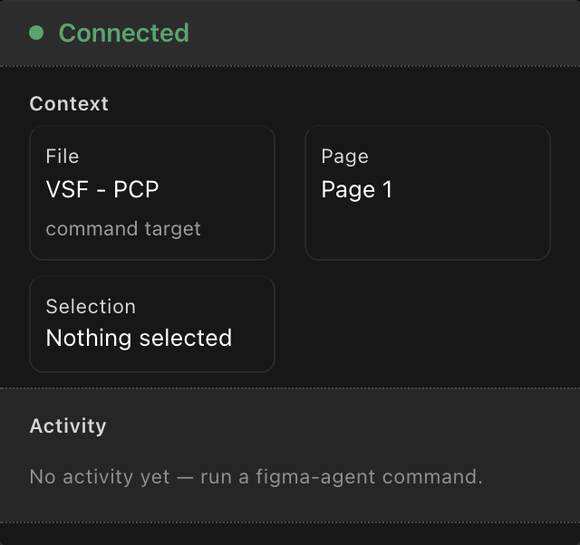
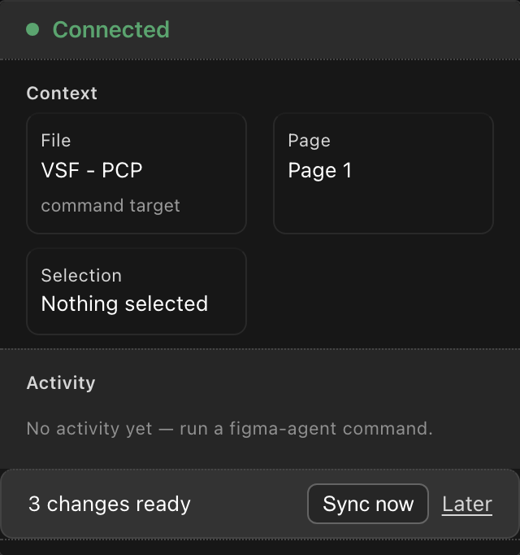
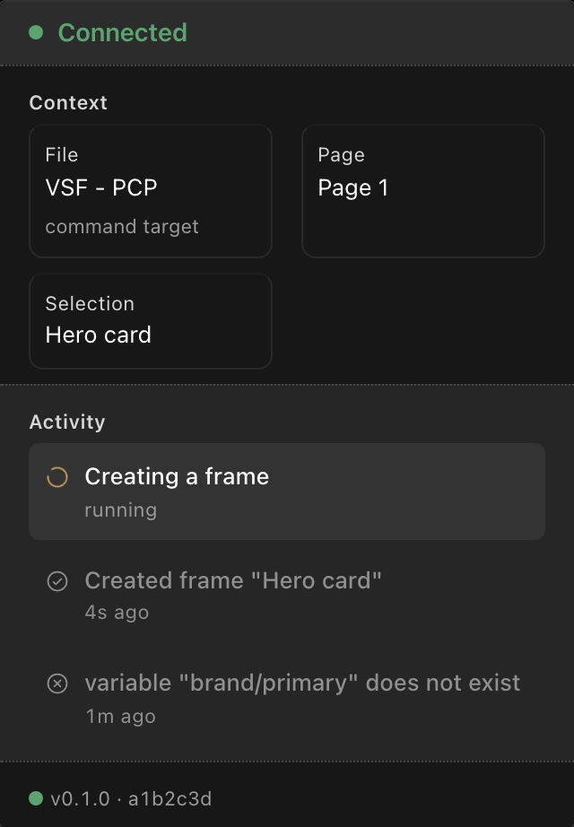
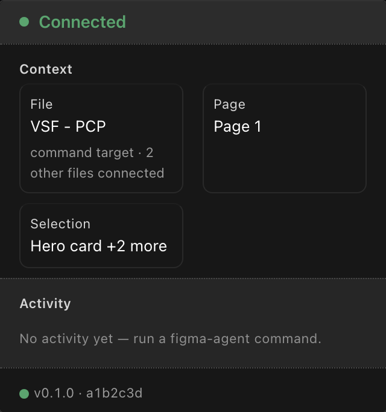

# design-os-figma-plugin

**An agent and a designer in the same Figma file.** A Figma Free plugin + CLI that lets
an AI coding agent draw on a real canvas, read back what a human just changed, and never
let the two trample each other.



Part of the [ease-design](https://github.com/jangtrinh/design-os) toolchain — this repo is
the optional, non-deterministic "hands" for its Figma authoring track. It talks to Figma only
through the public Plugin API (Figma Free, no paid write API, no OAuth, no seat).

```
you / an agent CLI ⇄ figma-agent CLI ⇄ local WebSocket broker (ports 9410-9419)
                                              ⇄ Figma plugin (Plugin API) ⇄ canvas
```

## Why this exists

Every AI-on-Figma setup hits the same three walls. The agent's work collapses into **one
giant undo step** — press ⌘Z after twenty minutes of automated work and twenty minutes
disappear. The designer's own edits are **invisible to the codebase** — a human moves a
component, and whatever registry the agent builds from quietly goes stale. And when both
act at once, they **trample each other** — half-applied scripts, overwritten changes, no
way to tell what happened. This plugin exists to remove exactly those three walls.

### Your edits reach the codebase — the right codebase

Every change a designer makes is captured live and, after the file goes quiet, offered back
as one prompt: **"N changes ready — Sync now."** A click runs a deterministic reconcile step
over the ledger — no model sits in that path, so a sync is reproducible and auditable. And a
sync cannot guess where it goes: each Figma file is bound to **its** project once —

```sh
figma-agent bind --file "Design System v4" --dir ~/code/your-app
```

— and from then on that file's changes land in that project's registry, never in whatever
directory a process happened to start from. Unbound files stage safely and migrate on bind.
The confirmation never flatters itself: *"Synced — 3 added, 1 updated"* only when records
were actually written, *"Nothing synced"* when the run landed nothing, and a failure keeps
the prompt alive so the retry is still there. `figma-agent changes` reads back the owner's
edit history as plain sentences any time — even while the plugin is closed, thanks to a
reconnect gap-fill diff.



### The agent cannot wreck your file

Every mutating operation seals **its own undo step** — ⌘Z rolls back one thing, not the
whole session. Arbitrary scripts run inside a bracket that **undoes itself on error**, and
reports `rolledBack: true` only when the rollback actually completed. Mutations are **jobs**:
one runs per file at a time, the rest queue in order, reads bypass the queue. A timeout tells
you the work was *not* cancelled and hands you a job id to poll; cancel actually cancels; a
reply that arrives after a job was killed is discarded, never served. Nothing is ever lost
silently — every eviction, prune, and rotation leaves a counter, an archive, or an audit
record. Every error lands in `design/figma-errors.jsonl` with its full untruncated reason —
a log written for the agent that caused it, so it can read and fix — and `figma-agent errors`
reads it back without ever crashing on a bad line.



### Multiple files, one broker

Several open Figma files stay connected at once — they no longer evict each other. Commands
route to the most-recently-active file, or pin to one with `FIGMA_AGENT_FILE`.



## Install / build

```bash
git clone https://github.com/jangtrinh/design-os-figma-plugin.git
cd design-os-figma-plugin
npm install
npm run build         # cli/dist/figma-agent.js + plugin/code.js + plugin/ui.html
```

## Load the plugin

Figma Desktop → Plugins → Development → Import plugin from manifest → select
`plugin/manifest.json`. Keep it open while using the CLI; the CLI's broker daemon
auto-starts on your first command and the plugin auto-reconnects to it.

## Bind a file to a project, then use the CLI

```bash
FA="node $(pwd)/cli/dist/figma-agent.js"
$FA status                                        # spawns the broker if absent; needs the plugin open
$FA bind --file "Design System v4" --dir ~/code/your-app
$FA create-frame --name Card --w 320 --h 200
$FA html-to-figma --html page.html --width 1440
$FA export-png --node <id> --out out.png          # then read the file to see the result
$FA changes --owner-only                          # the designer's own edits, in plain sentences
$FA errors --limit 10                             # what went wrong, and why
```

Every command prints one JSON object to stdout. See `cli/src/commands/` for the full list.

## The deterministic kernel (reconcile)

`figma-agent`'s own commands are enough to draw, read, and log. Turning a captured change
feed into an actual component-registry update runs through the deterministic kernel,
[`ease-design`](https://github.com/jangtrinh/design-os) (`npm i -g ease-design`) — install
it once and its `ui figma reconcile --apply` / `design-os figma reconcile` closes the loop
described above. No model call sits anywhere in that path.

## Structure

```
cli/          figma-agent CLI: commands, the broker daemon + WS transport
plugin/       Figma plugin: main-thread executor + a hidden-iframe HTML→Figma converter
shared/       wire-protocol types shared by cli/ and plugin/
scripts/      esbuild build script + an optional probe/ suite (site recon, visual diff)
tests/        vitest unit tests (pure-logic; run with `npm test`)
kernel/       git submodule bridge to the design-os kernel (dev-only, see below)
```

### Dev note: the `kernel/design-os` submodule (a bridge, not architecture)

`tests/figma-plugin-panel.test.ts` (the panel's craft/taste/a11y gate) runs the SAME four
linters every ease-design-generated artifact does. Those linters aren't part of the
published `ease-design` npm package yet, and an npm git-dependency doesn't help either —
npm applies the kernel's own publish `"files"` allowlist even to git-dependency installs,
so the linter sources never land in `node_modules` regardless of what the pinned commit
actually contains. `kernel/design-os` is a real git **submodule** instead (a raw checkout
npm packing can't touch), pinned to one commit — one source of truth, no local fork of
the linter subsystem.

- First clone: `git submodule update --init --depth 1` before running `npm test`. The
  panel test fails with that exact instruction if you forget.
- Bumping the pin: `cd kernel/design-os && git fetch --depth 1 origin <ref> && git
  checkout <ref>`, then commit the updated gitlink in this repo — a deliberate act, not
  automatic drift.
- This bridge is temporary: once the kernel publishes its linters as a real
  `ease-design/lint` subpath export, this submodule goes away and the panel test imports
  the published package directly instead.

## Supervised editing loop

`inspect` resolves an explicit node first and otherwise uses the current selection. It
returns the scoped node spec and a PNG marked `VISUAL_CHECK_REQUIRED`; run it before and
after visual mutation.

`clone-traits` copies only named groups: `layout`, `fills-variables`, `typography`,
`spacing`, and `text`. Text content is never copied unless `text` is explicitly included.

Successful typed mutations stamp agent-operation provenance. A later designer edit on the
same node becomes an immutable linked correction in Figma shared plugin data.
`sync-corrections` merges that bounded edge cache into the project's own
`design/memory/figma-corrections.jsonl`. Same-ID/different-hash conflicts are quarantined;
corrections never promote themselves into knowledge.

## The panel

Once loaded, the plugin opens a small (340×480) panel — the bridge's face. **Keep it open**
while you (or an agent) drive the CLI; closing it drops the connection.

**Status states** — the big pill updates live as the broker comes and goes:

| Pill | Meaning |
|---|---|
| **No broker yet** (muted) | Normal idle — not an error. The broker starts automatically on your first CLI command. |
| **Looking for broker…** (amber, pulsing) | Scanning `localhost:9410–9419`. After ~10s it nudges you to run `figma-agent status`. |
| **Handshaking…** (blue) | Broker found; registering this plugin. |
| **Connected** (green) | Ready — the CLI can drive this file. Shows the port + connection uptime. |

**Activity log** lists recent commands (tool · duration · time-ago, newest first) so you can
watch an agent work. **Connection details** (collapsible) exposes port, protocol version,
heartbeat age, reconnect attempts, and the file/page.

## Multiple files open at once

`figma-agent status` lists every connected file (`plugins[]`) and marks the **active** one
(`activePlugin`). By default a command goes to the file you touched most recently. To pin
commands to a specific file regardless of recency:

```bash
FIGMA_AGENT_FILE="VSF" $FA html-to-figma --html page.html   # only ever the "VSF …" file
```

With the pin set and no open file matching, the command waits briefly then fails with
`E_NO_PLUGIN` naming the requested file and listing the ones actually connected.

**Troubleshooting**

- **Panel says "No broker yet" and never connects** — that's the resting state; it only
  connects once a CLI command spawns the broker. Run `figma-agent status` to spawn + verify.
- **`E_NO_PLUGIN`** — the broker is up but no panel is connected: open (or reopen) the plugin
  and retry. Right after a rebuild the broker hot-replace can race the panel's reconnect
  (<1s) — just retry.
- **Stuck on "Looking for broker…"** — confirm a CLI command has actually run (the broker is
  demand-started) and that nothing else holds ports 9410–9419. `figma-agent status` is the
  one-shot health check.

## The `probe/` suite (optional)

`scripts/probe/` holds a small set of Playwright/Puppeteer-based helpers for reconnaissance
and visual-diff work on external sites (recon, network capture, screenshot diffing). These
use heavier browser-automation dependencies (`playwright`, `puppeteer-core`, `pixelmatch`,
`pngjs`) declared as `optionalDependencies` — they do not block installing or building the
core CLI/plugin if they fail to install in a given environment. Run `npm install playwright`
inside this repo to enable them.

## Attribution

- Broker/relay design adapted from `southleft/figma-console-mcp`'s websocket-server
  pending-request correlation and heartbeat approach (MIT).
- The plugin's HTML→Figma converter and node executors are ported from an earlier EaseUI
  internal tool (`figma-export.ts` / `figma-plugin/code.ts`).
- `scripts/probe/` ideas draw on `Jane-xiaoer/claude-skill-web-clone`'s `visual-diff.mjs`
  approach to measurable pixel-diff scoring.

## License

MIT — see [LICENSE](LICENSE).
