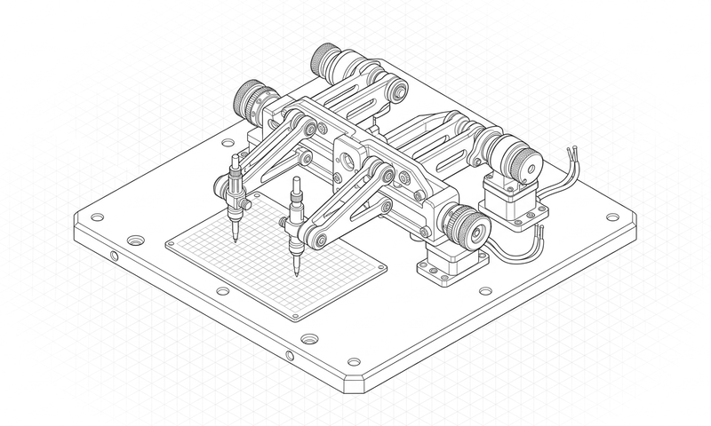

# DESIGN:OS Figma Plugin & CLI (`design-os-figma-plugin`)

**Zero-cost live Figma canvas bridge (`figma-agent` CLI + DESIGN:OS Bridge plugin) for AI coding agents — works on Figma Free.**

Inspect live selections, scan design systems, create frames, bind variables, mutate auto-layout traits, and export visual verification PNGs directly from Claude Code, Codex, Gemini CLI, and Antigravity.

<p align="center">
  
</p>

<p align="center">
  <a href="LICENSE"></a>
  
  <a href="commands/doctor.md"></a>
  <a href="https://jangtrinh.github.io/design-os-figma-plugin/"></a>
  <a href="https://buymeacoffee.com/jangtrinh"></a>
</p>

<p align="center">
  <a href="#quickstart">Quickstart</a> · <a href="#what-it-makes">What it makes</a> · <a href="#installation">Install</a> · <a href="#how-it-works">How it works</a> · <a href="#commands--diagnostics">Commands</a> · <a href="#quality-bar--limitations">Limits</a>
</p>

---

## Why this exists

Official read-only Figma MCPs dump 150k+ characters of noisy JSON into your context window and cannot write back to the canvas without expensive enterprise seats. **`design-os-figma-plugin`** pairs a local WebSocket relay with typed CLI commands (`inspect`, `scan-design-system`, `create-frame`, `set-text`, `export-png --assert`) that work on **Figma Free**.

| Dimension | Generic AI / Manual Workflow | DESIGN:OS Figma Plugin & CLI (`DESIGN:OS`) |
| :--- | :--- | :--- |
| **Canvas Write Access** | Read-only REST APIs or enterprise-only beta bridges | Full bidirectional read + write (`create-frame`, `set-text`, `clone-traits`, `exec-js`) on Figma Free |
| **Context Window Usage** | 155K-character raw node dumps that overflow agent context | Compact, depth-controlled `inspect` and `context` summaries |
| **Visual Verification** | Blindly mutating nodes without checking the rendered result | Mandatory `export-png --assert` visual proof loop before and after mutations |
| **Privacy & Cost** | Cloud relay servers and paid Dev Mode seat requirements | 100% localhost WebSocket bridge (`127.0.0.1`) with zero external telemetry |
| **Privacy & Telemetry** | Opaque cloud telemetry or unverified third-party APIs | **Zero telemetry** — 100% local execution ([`PRIVACY.md`](PRIVACY.md) audited) |

---

## Quickstart

### 1. Install the plugin or CLI

**In Claude Code:**

```text
/plugin marketplace add jangtrinh/design-os-figma-plugin
/plugin install design-os-figma-plugin@design-os-figma-plugin
```

**Or from your terminal (Codex, Gemini CLI, Antigravity, OpenCode, or standalone CLI):**

```bash
git clone https://github.com/jangtrinh/design-os-figma-plugin.git
cd design-os-figma-plugin
node bin/figma-agent.mjs status --peek
```

### 2. Ask in plain English

Open your project in your AI coding agent and describe what you need:

> "Inspect the currently selected Figma frame, extract its auto-layout and variable tokens, and build the matching React component."

> "Scan the active Figma file's design system tokens and create a new 1440x900 pricing section frame using our DLS components."

> "Update the copy and spacing on the selected hero frame in Figma and export a 2x PNG snapshot to verify visual parity."

### 3. Verify your setup

```bash
python3 scripts/self_check.py
```

---

## What it makes

Every deliverable produced by `design-os-figma-plugin` is backed by a deterministic verification gate rather than freehand AI guesswork.

<p align="center">
  <br>
  <sub>Prompt: <code>"Inspect the currently selected Figma frame, extract its auto-layout and variable tokens, and build the matching React component."</code></sub>
</p>

| Deliverable / Mode | Best for | Output Format | Verification Gate |
| :--- | :--- | :--- | :--- |
| **Live Canvas Inspection** | Reading exact auto-layout, variables, and typography from the active Figma selection | `Compact JSON / CLI summary` | `figma-agent inspect` |
| **Typed Canvas Mutations** | Creating frames, binding tokens, and updating text/layout directly from the terminal | `Live Figma nodes` | `Before/after inspect + export-png --assert` |
| **Visual Proof Exports** | Rendering high-DPI PNG snapshots of any Figma node for PR/artifact review | `Retina PNG artifact` | `Non-empty verified PNG on disk` |

---

## Installation

Choose the setup that matches your AI coding agent. Every option installs the same canonical skill (`skills/design-os-figma-craft/SKILL.md`) and `/doctor` diagnostic suite.

### Claude Code

Run these two commands inside Claude Code:

```text
/plugin marketplace add jangtrinh/design-os-figma-plugin
/plugin install design-os-figma-plugin@design-os-figma-plugin
```

### OpenAI Codex

Install to your personal Codex skills directory:

```bash
git clone https://github.com/jangtrinh/design-os-figma-plugin.git /tmp/design-os-figma-plugin
mkdir -p ~/.codex/skills/design-os-figma-craft ~/.codex/prompts
cp -R /tmp/design-os-figma-plugin/skills/design-os-figma-craft/* ~/.codex/skills/design-os-figma-craft/
cp /tmp/design-os-figma-plugin/prompts/doctor.md ~/.codex/prompts/design-os-figma-craft-doctor.md
rm -rf /tmp/design-os-figma-plugin
```

### Gemini CLI & Google Antigravity

```bash
git clone https://github.com/jangtrinh/design-os-figma-plugin.git /tmp/design-os-figma-plugin
mkdir -p ~/.gemini/skills/design-os-figma-craft
cp -R /tmp/design-os-figma-plugin/skills/design-os-figma-craft/* ~/.gemini/skills/design-os-figma-craft/
rm -rf /tmp/design-os-figma-plugin
```

### OpenCode, Cursor, Windsurf & Other Agent Harnesses

```bash
git clone https://github.com/jangtrinh/design-os-figma-plugin.git /tmp/design-os-figma-plugin
mkdir -p ~/.agents/skills/design-os-figma-craft
cp -R /tmp/design-os-figma-plugin/skills/design-os-figma-craft/* ~/.agents/skills/design-os-figma-craft/
rm -rf /tmp/design-os-figma-plugin
```

<details>
<summary>Verify or uninstall</summary>

**Verify installation:**

```bash
python3 scripts/self_check.py
```

Or run `/doctor` inside Claude Code / Codex to inspect installed skill paths, plugin manifests, and gate health.

**Uninstall:**

```bash
rm -rf ~/.claude/skills/design-os-figma-craft ~/.codex/skills/design-os-figma-craft ~/.gemini/skills/design-os-figma-craft ~/.agents/skills/design-os-figma-craft
```

</details>

---

## Usage & Prompt Cookbook

Once installed, `skills/design-os-figma-craft/SKILL.md` activates automatically when your prompt matches its domain triggers. Browse [`docs/cookbook.md`](docs/cookbook.md) for copy-paste prompt recipes.

**Generate & Scaffold**

```text
"Inspect the currently selected Figma frame, extract its auto-layout and variable tokens, and build the matching React component."
```

**Audit & Verify**

```text
"Scan the active Figma file's design system tokens and create a new 1440x900 pricing section frame using our DLS components."
```

**Export & Automate**

```text
"Update the copy and spacing on the selected hero frame in Figma and export a 2x PNG snapshot to verify visual parity."
```

---

## Commands & Diagnostics

| Command | Environment | What it does |
| :--- | :--- | :--- |
| `/doctor` | Claude Code / Codex | Read-only diagnostic check of installed skill paths, plugin manifests, and runtime prerequisites |
| `python3 scripts/self_check.py` | Terminal / CI | Deterministic offline verification of manifests, skill contracts, and governance files |
| `node bin/figma-agent.mjs status --peek` | Terminal / CI | Check live WebSocket bridge connection to the active Figma canvas without consuming queue commands |

---

## How it works

1. **Intent Routing** — Your AI agent matches your request against `skills/design-os-figma-craft/SKILL.md` frontmatter triggers.
2. **Progressive Context Loading** — Only the entry-point `SKILL.md` router loads initially; detailed recipes and scripts load on demand.
3. **Deterministic Execution** — Domain scripts and contracts execute locally with reproducible inputs and outputs.
4. **Gate Verification** — `scripts/self_check.py` and domain verifiers (`node bin/figma-agent.mjs status --peek`) validate the artifact before completion.
5. **Zero-Telemetry Delivery** — Verified files are written directly to your workspace with zero external network calls.

```text
User Prompt / CLI Invocation
            │
            ▼
┌───────────────────────────────────────────────┐
│ skills/design-os-figma-craft/SKILL.md
│ Progressive disclosure router & hard rules    │
└───────────┬───────────────────────────────────┘
            │ loads on demand
            ▼
┌───────────────────────────────────────────────┐
│ node bin/figma-agent.mjs status --peek
│ Deterministic build & contract enforcement    │
└───────────┬───────────────────────────────────┘
            │ verifies
            ▼
┌───────────────────────────────────────────────┐
│ python3 scripts/self_check.py + /doctor       │
│ Zero-telemetry local verification gate        │
└───────────────────────────────────────────────┘
```

### What loads when

`design-os-figma-plugin` uses progressive context disclosure so your agent's context window stays fast and focused:

| File | Loaded when |
| :--- | :--- |
| `skills/design-os-figma-craft/SKILL.md` | Always (~100–150 lines) — routing rules, triggers, and execution workflow |
| `docs/cookbook.md` | When selecting multi-step prompt recipes or domain patterns |
| `commands/doctor.md` / `prompts/doctor.md` | Only when running `/doctor` diagnostics |
| `llms.txt` | When indexed by AI answer engines, RAG pipelines, or repo crawlers |

---

## File structure

```text
design-os-figma-plugin/
├── .claude-plugin/
│   ├── plugin.json                 # Claude Code plugin manifest
│   └── marketplace.json            # Claude Code marketplace catalog
├── .codex-plugin/
│   └── plugin.json                 # OpenAI Codex plugin & interface manifest
├── .agents/
│   └── plugins/marketplace.json    # Cross-agent local plugin registry
├── .factory-plugin/
│   ├── plugin.json                 # Factory / Droid plugin manifest
│   └── marketplace.json            # Factory marketplace metadata
├── skills/
│   └── design-os-figma-craft/
│       └── SKILL.md                # Canonical agent skill entrypoint
├── commands/
│   └── doctor.md                   # /doctor diagnostic slash command
├── prompts/
│   └── doctor.md                   # Codex diagnostic prompt mirror
├── scripts/
│   └── self_check.py               # Deterministic repository & skill self-check
├── docs/
│   ├── cookbook.md                 # Copy-paste prompt recipes by job
│   └── llms.txt                    # GEO / LLM discovery index
├── PRIVACY.md                      # Zero-telemetry & local-first privacy commitment
├── SECURITY.md                     # Vulnerability disclosure & security policy
├── CONTRIBUTING.md                 # Contribution workflow & verification rules
├── CODE_OF_CONDUCT.md              # Contributor Covenant code of conduct
├── CHANGELOG.md                    # Release history
├── llms.txt                        # Root LLM indexing manifest
├── LICENSE                         # PolyForm Shield 1.0.0
└── README.md
```

---

## Quality bar & Limitations

### It's working if...

- `python3 scripts/self_check.py` prints `ok: design-os-figma-plugin self-check passed (design-os-figma-craft)` and exits `0`.
- `node bin/figma-agent.mjs status --peek` passes with zero contract or test regressions.
- Your AI coding agent loads `skills/design-os-figma-craft/SKILL.md` automatically when given any prompt from [`docs/cookbook.md`](docs/cookbook.md).
- Network traffic during execution remains zero (guaranteed by [`PRIVACY.md`](PRIVACY.md)).

### When not to use

- Headless CI servers where the Figma Desktop or browser app is not open with the plugin connected.
- Converting arbitrary live HTML pages via third-party `html-to-figma` scrapers (use screenshot image fills or native typed frame builders instead).
- Editing vector mesh illustrations better suited for `design-os-svg-animation` or `design-os-3d-blender`.

---

## DESIGN:OS Ecosystem

`design-os-figma-plugin` is one of the 13 source-available engines in the **`DESIGN:OS`** ecosystem:

| Engine | Live Docs | Repository | Layer |
| :--- | :--- | :--- | :--- |
| **DESIGN:OS CLI** | [jangtrinh.github.io/design-os](https://jangtrinh.github.io/design-os/) | [`jangtrinh/design-os`](https://github.com/jangtrinh/design-os) | `cli` |
| **Knowledge Builder** | [jangtrinh.github.io/design-os-knowledge-builder](https://jangtrinh.github.io/design-os-knowledge-builder/) | [`jangtrinh/design-os-knowledge-builder`](https://github.com/jangtrinh/design-os-knowledge-builder) | `compiler` |
| **Figma Plugin & CLI** | [jangtrinh.github.io/design-os-figma-plugin](https://jangtrinh.github.io/design-os-figma-plugin/) | [`jangtrinh/design-os-figma-plugin`](https://github.com/jangtrinh/design-os-figma-plugin) | `plugin` |
| **SVG Animation Engine** | [jangtrinh.github.io/design-os-svg-animation](https://jangtrinh.github.io/design-os-svg-animation/) | [`jangtrinh/design-os-svg-animation`](https://github.com/jangtrinh/design-os-svg-animation) | `engine` |
| **3D Blender Agent** | [jangtrinh.github.io/design-os-3d-blender](https://jangtrinh.github.io/design-os-3d-blender/) | [`jangtrinh/design-os-3d-blender`](https://github.com/jangtrinh/design-os-3d-blender) | `3d / cad` |
| **OPAH ONE Drone** | [jangtrinh.github.io/design-os-drone-showcase](https://jangtrinh.github.io/design-os-drone-showcase/) | [`jangtrinh/design-os-drone-showcase`](https://github.com/jangtrinh/design-os-drone-showcase) | `hardware` |
| **GitHub Pages Engine** | [jangtrinh.github.io/design-os-github-page](https://jangtrinh.github.io/design-os-github-page/) | [`jangtrinh/design-os-github-page`](https://github.com/jangtrinh/design-os-github-page) | `pages` |
| **Apple Design OS** | [jangtrinh.github.io/design-os-apple](https://jangtrinh.github.io/design-os-apple/) | [`jangtrinh/design-os-apple`](https://github.com/jangtrinh/design-os-apple) | `swiftui` |
| **Agent Teacher** | [jangtrinh.github.io/design-os-pedagogy](https://jangtrinh.github.io/design-os-pedagogy/) | [`jangtrinh/design-os-pedagogy`](https://github.com/jangtrinh/design-os-pedagogy) | `pedagogy` |
| **Origami CAD** | [jangtrinh.github.io/design-os-origami](https://jangtrinh.github.io/design-os-origami/) | [`jangtrinh/design-os-origami`](https://github.com/jangtrinh/design-os-origami) | `packaging` |
| **Voice UX Architecture** | [jangtrinh.github.io/design-os-voice-ux](https://jangtrinh.github.io/design-os-voice-ux/) | [`jangtrinh/design-os-voice-ux`](https://github.com/jangtrinh/design-os-voice-ux) | `voice-ai` |
| **Code2Flow** | [jangtrinh.github.io/design-os-code2flow](https://jangtrinh.github.io/design-os-code2flow/) | [`jangtrinh/design-os-code2flow`](https://github.com/jangtrinh/design-os-code2flow) | `ast / audit` |
| **Generative UI** | [jangtrinh.github.io/design-os-generative-ui](https://jangtrinh.github.io/design-os-generative-ui/) | [`jangtrinh/design-os-generative-ui`](https://github.com/jangtrinh/design-os-generative-ui) | `runtime` |

---

## Contributing, Governance & License

- **Contributing**: See [`CONTRIBUTING.md`](CONTRIBUTING.md) for pull request guidelines and verification gates (`python3 scripts/self_check.py`).
- **Code of Conduct**: Governed by [`CODE_OF_CONDUCT.md`](CODE_OF_CONDUCT.md).
- **Security & Privacy**: Zero telemetry — see [`SECURITY.md`](SECURITY.md) and [`PRIVACY.md`](PRIVACY.md).
- **Changelog & LLM Index**: Track releases in [`CHANGELOG.md`](CHANGELOG.md) and machine-readable index in [`llms.txt`](llms.txt).
- **License**: [PolyForm Shield 1.0.0](LICENSE) © [Jang Trinh](https://github.com/jangtrinh). Free to use and modify, including for paid client work; you may not resell it or build a competing product from it.

---

If `design-os-figma-plugin` saves you time, a star on GitHub helps other engineers and AI agents find it.

<p align="left">
  <a href="https://buymeacoffee.com/jangtrinh">
    
  </a>
</p>
